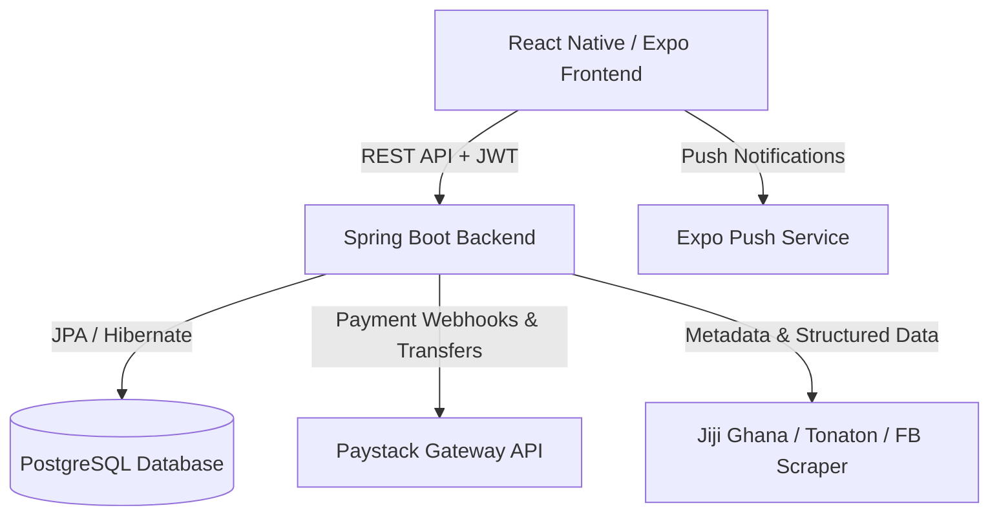
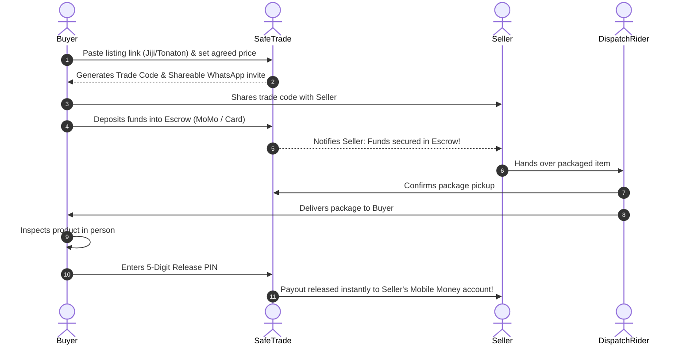

# 🛡️ SafeTrade: Secure Peer-to-Peer Escrow & Marketplace Protection Platform

> **SafeTrade** is a peer-to-peer escrow commerce platform tailored for Ghana and African digital marketplaces (Jiji Ghana, Facebook Marketplace, Tonaton). It eliminates trade fraud and scam risks by holding funds securely in escrow until goods are physically inspected and approved by the buyer.

---

## 📑 Table of Contents
0. [📚 Feature Documentation Library (`docs/`)](./docs/README.md)
1. [Overview & Problem Statement](#-overview--problem-statement)
2. [Key Capabilities & Innovations](#-key-capabilities--innovations)
3. [Architecture & Technology Stack](#-architecture--technology-stack)
4. [Escrow & Trade Lifecycle](#-escrow--trade-lifecycle)
5. [Marketplace Link Inspection Engine](#-marketplace-link-inspection-engine)
6. [Delivery Modes](#-delivery-modes)
7. [API Documentation](#-api-documentation)
8. [Project Structure](#-project-structure)
9. [Setup & Installation Guide](#-setup--installation-guide)
10. [Environment Configuration](#-environment-configuration)
11. [Security & Verification Standards](#-security--verification-standards)

---

## 🎯 Overview & Problem Statement

Online trading on classifieds (e.g. Jiji, Facebook Marketplace, Tonaton) suffers from high scam rates, impersonation, fake payments, and goods-never-delivered fraud. 

**SafeTrade solves this by acting as the trusted financial and logistical escrow intermediary:**
- **For Buyers:** Your money (in Ghana Cedis `GH₵`) is locked safely in escrow. Sellers are only paid when you inspect the item and provide your 5-digit release code.
- **For Sellers:** You never dispatch goods without guaranteed escrow proof. SafeTrade confirms the buyer has deposited 100% of the funds before you ship.
- **For Riders/Hubs:** Safe verification at every step using QR codes and verification PINs.

---

## 🌟 Key Capabilities & Innovations

### 1. 🔗 External Marketplace Link Inspector
- Paste any listing URL from **Jiji Ghana (`jiji.com.gh`)**, **Tonaton**, or **Facebook Marketplace**.
- Automatically extracts:
  - **Item Name & Title**
  - **Original Listed Price** (in GHS)
  - **Seller Contact & Phone Number**
  - **Exact Neighborhood & Region** (e.g., *Spintex, Greater Accra, Ghana*)
  - **Structured Key-Value Specs Grid** (e.g., *Type, Brand, Model, Memory Size, Interface*)
  - **High-Resolution Item Photo** (with JSON-LD parsing & dynamic web representative image fallback)
- Allows buyers to enter their **Agreed Final Price** and choose a **Delivery Mode** with 1-tap WhatsApp sharing.

### 2. 📱 Smart Three-Portal Experience
- **Buyer Portal:** Browse inspected marketplace deals, create escrow trades, fund via Mobile Money / Card, inspect goods, and release payments.
- **Seller Portal:** Create direct item listings, review buyer escrow deposits, upload packaging proof, and trigger payouts.
- **Rider / SafePost Portal:** Dispatch tracking, pick up packages from sellers, deposit at SafeTrade hubs, and complete deliveries.

### 3. 💳 Mobile Money (MoMo) & Card Escrow Payments
- Seamless integration with **Paystack Ghana** supporting MTN Mobile Money, Vodafone Cash, AirtelTigo Money, Visa, and Mastercard.
- Automated webhook handling for real-time escrow funding confirmation.

### 4. 🔐 5-Digit Cryptographic Code & Release Pin System
- Each trade generates a unique trade code (`TRD-XXXXX`) for joining deals and a private 5-digit release code only revealed to the buyer upon payment.
- The seller or rider receives payout immediately upon entry of this release code.

---

## 🏗️ Architecture & Technology Stack



### 📱 Frontend Stack
- **Framework:** [React Native](https://reactnative.dev/) with [Expo](https://expo.dev/) (SDK 53)
- **Routing:** Expo Router (File-based navigation)
- **Language:** TypeScript
- **State Management:** Zustand (`authStore`, `inspectStore`)
- **UI & Icons:** Lucide Icons, Expo Vector Icons (Ionicons), Safe Area Context
- **Media & Hardware:** `expo-image-picker`, `expo-clipboard`, `expo-linking`
- **Network Client:** Axios with JWT interceptors & token auto-renewal

### ⚙️ Backend Stack
- **Framework:** [Spring Boot 3.x](https://spring.io/projects/spring-boot) (Java 17+)
- **Security:** Spring Security, JWT (JSON Web Tokens), BCrypt password hashing
- **Database:** PostgreSQL (with Hibernate / Spring Data JPA)
- **Web Scraping & Metadata Parsing:** Jsoup, Jackson JSON-LD engine
- **Payments:** Paystack API Client & Webhook Controller
- **Build Tool:** Maven

---

## 🔄 Escrow & Trade Lifecycle



---

## 🔗 Marketplace Link Inspection Engine

SafeTrade's link preview engine operates on a multi-tiered extraction strategy:

1. **Structured Data Parsing (JSON-LD)**: Extracts `@type: Product`, price, brand, and clean images from `script[type="application/ld+json"]`.
2. **OpenGraph & Meta Fallbacks**: Parses `og:title`, `og:image`, `og:description`, `geo.placename`, and `twitter:*` tags.
3. **DOM Specification Mining**: Parses key-value attributes (e.g. `.b-advert-attribute`) into structured specification cards.
4. **Ghana Geocoding Filter**: Validates listings from Ghana (`jiji.com.gh`) and extracts localized regions/towns (*Spintex, East Legon, Osu, Tema, Kumasi*, etc.).
5. **Intelligent Web Representative Image Resolution**: If CDN hotlinking fails, it pairs the listing with a clean high-resolution product image matching the exact hardware/model keyword.

---

## 🚚 Delivery Modes

| Delivery Mode | Description | Verification Method |
| :--- | :--- | :--- |
| 🏢 **SafeTrade Hub Delivery** | Seller drops off at a physical SafeTrade Post. Buyer visits post to inspect and pick up. | Hub Operator PIN + Buyer QR |
| 🏍️ **Direct Dispatch Rider** | Verified SafeTrade rider picks up from seller and brings directly to buyer's door. | Rider GPS tracking + Delivery PIN |
| 🤝 **In-Person Handover** | Buyer and seller meet in a public location. | 5-digit Buyer Release Code |

---

## 📡 API Documentation

### 🔐 Authentication & Users (`/api/auth`, `/api/v2/users`)
- `POST /api/auth/register` — Register a new account (Buyer, Seller, or Rider)
- `POST /api/auth/login` — Login and obtain JWT bearer token
- `GET /api/v2/users/{id}` — Get profile and balance details
- `POST /api/v2/users/push-token` — Register Expo push notification token
- `POST /api/v2/users/topup` — Top up wallet balance

### 📦 Trades & Escrow Deals (`/api/v2/trades`, `/api/trades`)
- `GET /api/v2/trades` — List user's active and completed trades
- `GET /api/v2/trades/{id}` — Get full details, status, and timeline of a trade
- `POST /api/v2/trades` — Create a new trade deal (from scratch or marketplace link)
- `POST /api/v2/trades/{id}/deposit` — Lock funds into escrow for the trade
- `POST /api/v2/trades/{id}/seller-upload` — Upload product dispatch photos
- `POST /api/v2/trades/{id}/rider-pickup` — Rider confirms item pickup
- `POST /api/v2/trades/{id}/buyer-collect` — Buyer inspects and accepts item with release code

### 🔗 Link Preview & Inspection (`/api/link-preview`)
- `POST /api/link-preview/parse` — Scrapes and normalizes metadata from Jiji Ghana, Tonaton, and Facebook Marketplace:
  ```json
  {
    "url": "https://jiji.com.gh/spintex/computer-hardware/nvidia-quadro-p4000..."
  }
  ```

### 💳 Escrow & Payments (`/api/escrow`, `/api/paystack`)
- `POST /api/escrow/init/{tradeId}` — Initialize Paystack checkout session
- `POST /api/escrow/release/{tradeId}` — Release funds to seller
- `POST /api/escrow/refund/{tradeId}` — Issue refund to buyer on dispute
- `POST /api/paystack/webhook` — Real-time payment verification webhook

---

## 📁 Project Structure

```
safetrade/
├── backend/
│   ├── src/main/java/com/safetrade/safetradebackend/
│   │   ├── config/              # SecurityConfig, CorsConfig, PaystackConfig
│   │   ├── controller/          # REST Controllers (Auth, Trades, LinkPreview, Escrow)
│   │   ├── model/               # JPA Entities & DTOs (Users, Trades, LinkPreviewResponse)
│   │   ├── repository/         # Spring Data JPA Repositories
│   │   ├── service/            # Business Logic & Jsoup Scraper Engine
│   │   └── util/               # JWT Token & Crypto Utilities
│   └── pom.xml                  # Backend dependencies
│
└── frontend/
    ├── app/                     # Expo Router file-based screens
    │   ├── (seller)/            # Seller portal views
    │   ├── (rider)/             # Dispatch rider portal views
    │   ├── trade/[id].tsx       # Active escrow deal detail & payment screen
    │   ├── marketplace-inspect.tsx # Dedicated listing inspection & agreement screen
    │   └── login.tsx / register.tsx
    ├── components/              # Reusable UI cards, headers, buttons, trust badges
    ├── hooks/                   # useAuth, useTheme, useTrades
    ├── services/                # API clients (api.ts, tradeService.ts, linkService.ts)
    ├── store/                   # Zustand state stores (authStore.ts, inspectStore.ts)
    └── utils/                   # Currency formatters & image lookup helpers
```

---

## 🚀 Setup & Installation Guide

### Prerequisites
- **Java 17+** & **Maven 3.8+**
- **Node.js 18+** & **npm** / **yarn**
- **PostgreSQL 14+**
- **Expo Go** mobile app (for testing on iOS/Android devices)

### 1. Backend Setup
```bash
cd backend
# Configure application.properties with your PostgreSQL credentials & Paystack keys
./mvnw clean install
./mvnw spring-boot:run
```
*Backend runs on `http://localhost:8080` (or your local IP for mobile LAN access).*

### 2. Frontend Setup
```bash
cd frontend
npm install
npx expo start
```
*Scan the generated QR code in Expo Go to launch the app.*

---

## 🔒 Security & Verification Standards

- **JWT Stateless Authentication**: Secure token verification for every endpoint.
- **Paystack Webhook Signatures**: All incoming payment notifications verify `x-paystack-signature` HMAC SHA512 hashes.
- **5-Digit Release Code Barrier**: Money cannot be moved out of escrow without physical buyer acceptance code.
- **Ghana Domain Policy**: Enforces `jiji.com.gh` filtering to prevent cross-border fraudulent links.

---

## 📄 License
This project is licensed under the MIT License.
