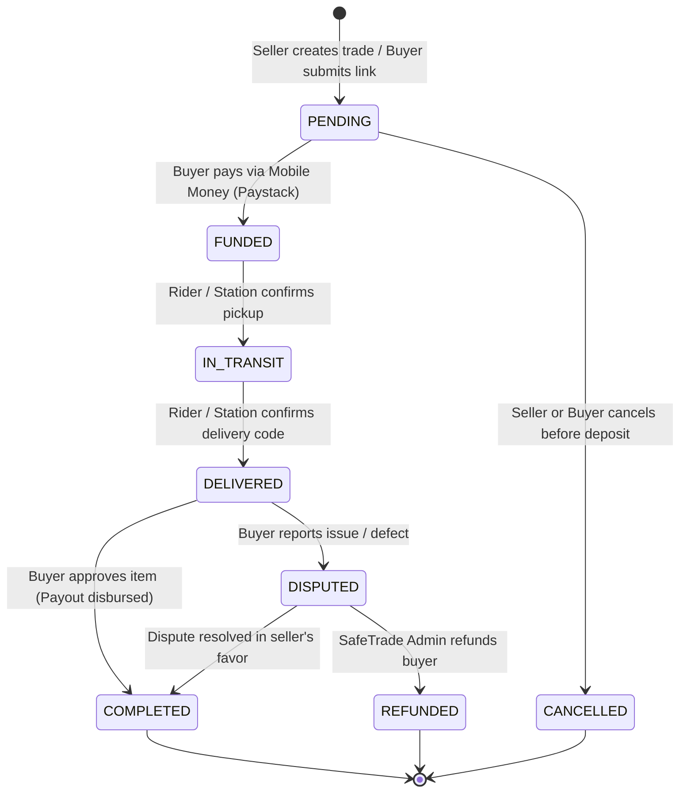

# 01 — Escrow Protection & Payment Flows

The **SafeTrade Escrow Shield** guarantees that neither buyers nor sellers are cheated during online transactions. Funds are held in a secure programmatic escrow custody until the buyer physically verifies and accepts the product.

---

## 🔒 Escrow Lifecycle State Machine

---

## 💰 Currency & Payment Infrastructure

- **Primary Currency**: Ghana Cedis (`GH₵` / `GHS`).
- **Payment Provider**: Paystack API (Ghana Gateway).
- **Supported Payment Channels**:
  1. **MTN Mobile Money** (MoMo)
  2. **Telecel Cash** (Vodafone Cash)
  3. **AT Money** (AirtelTigo)
  4. **Debit/Credit Cards** (Visa / Mastercard)

---

## 🔄 Step-by-Step Escrow Workflow

### 1. Trade Creation
- The seller (or buyer via marketplace link) initiates a trade specifying:
  - Product Title & Description
  - Item Price (`GH₵`)
  - Delivery Method (`RIDER`, `POST_STATION`, `IN_PERSON`)
  - Delivery Fee (`GH₵`)
- SafeTrade generates a unique **Trade Code** (e.g. `TRD-74921`).

### 2. Deposit & Fund Locking
- The buyer opens the trade in the Buyer Portal and clicks **"Accept & Pay with Escrow"**.
- A Paystack checkout initialize call creates an authorization link.
- Once the Mobile Money payment is confirmed via Paystack Webhook / callback:
  - The trade status shifts to `FUNDED`.
  - Funds are locked in escrow.
  - The seller receives an instant notification: *"Payment secured in SafeTrade Escrow. You can now dispatch the item."*

### 3. Transit & Handover Verification
- If delivery is by **Dispatch Rider**: The rider verifies pickup with the seller and drops off using dual 4-digit codes.
- If delivery is by **SafeTrade Post**: The item is lodged at a certified physical SafeTrade station.

### 4. Inspection & Fund Release
- The buyer inspects the package.
- If satisfied, the buyer taps **"Confirm Receipt & Release Funds"**.
- The backend triggers an automated transfer to the seller’s registered Mobile Money account.

---

## 🛡️ Dispute Resolution & Protection

If an item is counterfeit, damaged, or not as described:
1. The buyer taps **"Report Issue / Dispute"** before the 24-hour auto-release window closes.
2. Escrow funds remain frozen.
3. SafeTrade dispute officers review photos, delivery records, and chat logs.
4. If approved, funds are 100% refunded to the buyer's Mobile Money wallet.

---

## 🔌 Relevant Backend APIs

| Method | Endpoint | Description |
|---|---|---|
| `POST` | `/api/trades` | Create a new escrow trade |
| `POST` | `/api/trades/{id}/accept` | Buyer accepts trade and locks funds |
| `POST` | `/api/trades/{id}/release` | Buyer releases escrow funds to seller |
| `POST` | `/api/trades/{id}/dispute` | Buyer files a dispute on delivered trade |
| `PUT` | `/api/users/bank-details` | Update seller's MoMo payout account |
