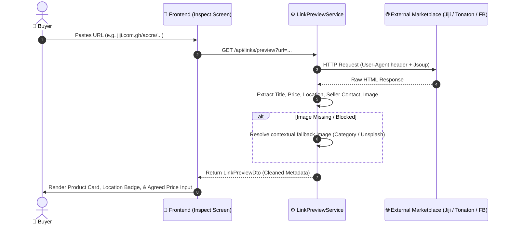

# 02 — Marketplace Link Inspector & Scraper

The **Marketplace Link Inspector** allows buyers to paste URLs from popular external peer-to-peer marketplaces in Ghana (e.g. Jiji, Tonaton, Facebook Marketplace), automatically inspect the listing details, negotiate an agreed price, and turn the deal into an escrow-protected SafeTrade transaction.

---

## 🛍️ Supported Marketplaces

1. **Jiji Ghana** (`jiji.com.gh`)
2. **Tonaton Ghana** (`tonaton.com`)
3. **Facebook Marketplace** (`facebook.com/marketplace`)

---

## 🔍 Metadata Extraction Pipeline

When a user pastes a product link into the Buyer's Explore screen or `/inspect` page, the backend executes the following scraping and normalization flow:

---

## 📋 Extracted Data Points

| Field | Description | Example Extracted Value |
|---|---|---|
| `title` | Product headline/model name | `"Apple iPhone 13 Pro Max 256GB Sierra Blue"` |
| `price` | Listed price in Ghana Cedis | `"GH₵ 7,500"` |
| `location` | Specific location in Ghana | `"East Legon, Greater Accra, Ghana"` |
| `contact` | Seller contact number (if public) | `"024 123 4567"` |
| `description` | Full item condition and seller note | `"Clean, battery health 89%, with original box."` |
| `imageUrl` | High-res photo of item | `https://...` (or dynamic categorized fallback) |
| `platform` | Detected source platform | `"JIJI"`, `"TONATON"`, `"FACEBOOK"` |

---

## 🎨 Inspector UI Features

- **Dedicated Inspection Page (`/inspect`)**: Keeps the inspection workflow clean and separated from the main home feed.
- **Agreed Price Input**: An interactive field where the buyer inputs the discounted price agreed upon with the seller on chat/call.
- **Delivery Mode Selector**: Quick radio/chip selection between:
  - 🏍️ **Dispatch Rider** (Home/Office door delivery)
  - 🏢 **SafeTrade Post Station** (Physical drop-off & pickup point)
  - 🤝 **In-Person Meetup** (Escrow released upon physical handshake)
- **Direct Trade Conversion**: One-click **"Create Escrow Trade"** button that initializes a real escrow contract with the extracted details.

---

## 🔌 Relevant Backend APIs

| Method | Endpoint | Description |
|---|---|---|
| `GET` | `/api/links/preview?url={targetUrl}` | Parse marketplace URL and extract structured metadata |
