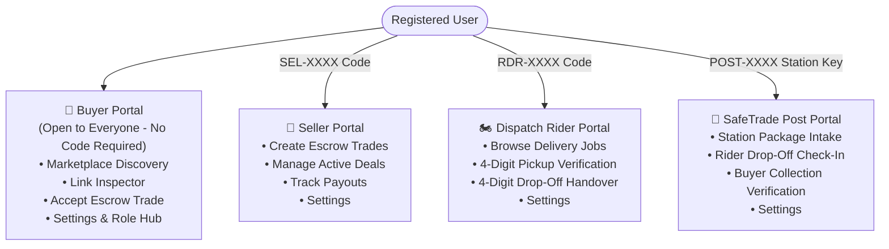

# 03 — Portals & Role Activation System

To ensure strong operational isolation, security, and specialized user experiences, SafeTrade splits its application into 4 distinct portals governed by role permissions and unique activation codes.

---

## 🏛️ The Four Specialized Portals

---

## 🔑 Access Rules & Code Gating

| Portal | Gating Rule | Activation Code Format | How to Obtain |
|---|---|---|---|
| **Buyer** | **Universal** | *None required* | Available automatically to all registered users upon sign-up. |
| **Seller** | **Account-Bound** | `SEL-XXXX` (e.g. `SEL-8492`) | Generated automatically at sign-up when opting for *Seller Account* or *Both*. |
| **Dispatch Rider** | **Account-Bound** | `RDR-XXXX` (e.g. `RDR-3910`) | Generated automatically at sign-up when opting for *Dispatch Rider* or *Both*. |
| **SafeTrade Post** | **Station Authorized** | `POST-XXXX` (e.g. `POST-GH26`) | Issued to certified station managers and physical shop operators. |

---

## 📝 Registration Flow & Credentials Generation

1. When registering on [sign-up.tsx](file:///c:/Users/NUKE/Desktop/newnewSAFETRADE/safetrade/frontend/app/sign-up.tsx), users select their intended account type:
   - 🛒 **Buyer Only** (Standard)
   - 💼 **Seller Account** (Generates Seller Code)
   - 🏍️ **Dispatch Rider** (Generates Rider Code)
   - ⚡ **Seller & Rider (Both)** (Generates Dual Codes)
2. Upon verification, a **Welcome & Credentials Dialog** pops up displaying their unique activation codes.
3. The codes are saved securely to the user's database record.

---

## ⚙️ Settings Portal Switcher & Unlock Hub

In [SettingsScreen.tsx](file:///c:/Users/NUKE/Desktop/newnewSAFETRADE/safetrade/frontend/components/shared/SettingsScreen.tsx), users can:
- **View Active Portal**: Indicates which portal is currently running.
- **One-Tap Switch**: If a portal is already authorized (`isSellerApproved`, `isRiderApproved`, etc.), tapping **"Switch"** immediately routes to that portal layout.
- **Unlock with Code**: If a portal is locked, tapping **"Unlock"** opens a modal to input the activation code. The backend validates the code and permanently unlocks the portal.
- **My Codes Viewer**: A quick-access modal where users can view and copy their personal activation codes at any time.

---

## 🔌 Relevant Backend APIs

| Method | Endpoint | Description |
|---|---|---|
| `POST` | `/api/users/register` | Register new account with opted role and generate activation codes |
| `POST` | `/api/users/unlock-role` | Unlock Seller, Rider, or Post portal using an activation code |
| `GET` | `/api/users/me` | Fetch user profile with authorization flags (`isSellerApproved`, etc.) |
