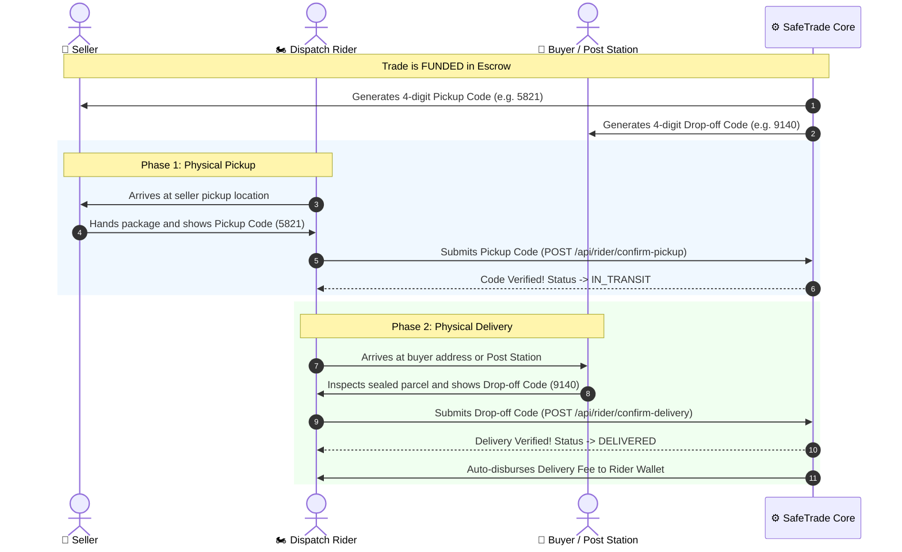

# 04 — Dispatch Rider Delivery System

SafeTrade incorporates a dedicated **Dispatch Rider Network** with a cryptographic dual-verification handshake that prevents lost packages, false deliveries, and unverified handovers.

---

## 🔐 The Dual 4-Digit Handshake Protocol

---

## 🚚 Delivery Workflow Stages

### 1. Job Assignment
- When a buyer orders an item with `RIDER` delivery, the trade appears in the rider's active dispatch feed.
- The delivery fee is locked inside the escrow contract.

### 2. Phase 1 — Pickup Verification
- The seller holds a dynamic **Pickup Code**.
- The rider physically receives the item, inspects the packaging, and enters the pickup code into the Rider app.
- Once verified, custody is transferred to the rider, and the trade status updates to `IN_TRANSIT`.

### 3. Phase 2 — Drop-off Verification
- The buyer holds a dynamic **Drop-off Code**.
- When the rider arrives at the destination, the buyer provides their 4-digit code.
- The rider inputs the code into the app.
- Upon matching, the trade updates to `DELIVERED`, releasing the delivery payout instantly to the rider.

---

## 📱 Rider Portal Features

- **Active Jobs Feed**: Displays pickup/drop-off addresses, seller contact, buyer contact, and earned delivery fee (`GH₵`).
- **Enter Delivery Code Screen (`/enter-code`)**: High-speed numerical keypad for verifying handovers in seconds.
- **Rider Earnings History**: Summary of completed deliveries and total accumulated payout.

---

## 🔌 Relevant Backend APIs

| Method | Endpoint | Description |
|---|---|---|
| `GET` | `/api/rider/ongoing` | Fetch all active delivery assignments for the logged-in rider |
| `POST` | `/api/rider/confirm-pickup` | Verify seller's 4-digit pickup code and start transit |
| `POST` | `/api/rider/confirm-delivery` | Verify buyer's 4-digit drop-off code and mark delivered |
