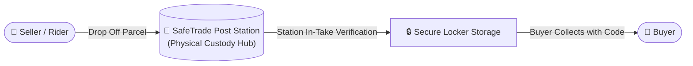

# 05 — SafeTrade Post Network

The **SafeTrade Post Network** is a decentralized chain of physical pickup points and verified partner shops (e.g. retail stores, pharmacies, partner hubs) across Ghana where items can be securely dropped off by sellers/riders and collected by buyers at their own convenience.

---

## 🏢 How SafeTrade Post Works

---

## 🛡️ Advantages of SafeTrade Post

1. **No Meeting Strangers**: Buyers and sellers don't have to disclose personal home addresses or meet at dangerous locations at night.
2. **Flexible Pickup Window**: Buyers have up to 48 hours to collect their package from the nearest station.
3. **On-Site Inspection Booth**: Post stations provide a safe, monitored table where buyers can unbox and verify gadgets before releasing escrow funds.

---

## 📦 Station Operator Handover Procedures

### 1. In-Take Drop-Off (Seller or Rider to Station)
- The rider or seller brings the parcel to the SafeTrade Post station.
- The station operator checks the trade details in the **Post Operator Portal** (`/(post)/home`).
- The operator requests the rider's **Drop-Off Code** and verifies it in the portal (`POST /api/trades/{id}/post-dropoff`).
- The item is assigned to a physical locker box.

### 2. Buyer Collection & Unboxing
- The buyer visits the designated SafeTrade Post station.
- The buyer presents their unique **Pick-Up Code** to the station operator.
- The operator verifies the code in the portal (`POST /api/trades/{id}/buyer-collect`).
- The package is handed to the buyer for on-site inspection.

---

## 🔌 Relevant Backend APIs

| Method | Endpoint | Description |
|---|---|---|
| `GET` | `/api/trades` | Fetch all parcels scheduled for the station |
| `POST` | `/api/trades/{id}/post-dropoff` | Station operator verifies rider drop-off code |
| `POST` | `/api/trades/{id}/buyer-collect` | Station operator verifies buyer pickup code and completes handover |
