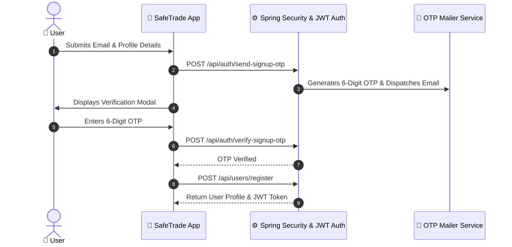

# 06 — Authentication & Identity Verification

SafeTrade enforces strict user authentication and identity verification standards to maintain trust, deter fraudsters, and comply with financial regulations in Ghana.

---

## 🔐 Authentication Architecture

---

## 🆔 KYC & Identity Verification (Ghana Card)

To prevent scamming and allow higher transaction tiers, users can verify their legal identity in [SettingsScreen.tsx](file:///c:/Users/NUKE/Desktop/newnewSAFETRADE/safetrade/frontend/components/shared/SettingsScreen.tsx).

### Supported ID Types:
1. **Ghana Card** (Format: `GHA-XXXXXXXXX-X`)
2. **Passport**
3. **Voter's ID**

### Verification Badge:
- Once submitted and verified (`isVerified = true`), an official **Verified Badge** appears next to the user's name on product listings, trade cards, and chat windows.

---

## 💳 Mobile Money Payout Account Binding

Sellers and riders configure their default disbursement wallet under **Settings > Payment Details**:
- **Supported Networks**: MTN Mobile Money, Telecel Cash (Vodafone), AirtelTigo Money.
- **Fields**: Account Name, Phone Number, Network Provider.
- **Paystack Subaccount Integration**: Used for automated direct bank/wallet settlement upon buyer confirmation.

---

## 🔌 Relevant Backend APIs

| Method | Endpoint | Description |
|---|---|---|
| `POST` | `/api/auth/send-signup-otp` | Send 6-digit verification code to email |
| `POST` | `/api/auth/verify-signup-otp` | Validate 6-digit OTP |
| `POST` | `/api/users/login` | Authenticate user and issue JWT token |
| `POST` | `/api/users/register` | Register new user account |
| `POST` | `/api/users/verify-account` | Submit Ghana Card / ID document for verification |
| `PUT` | `/api/users/bank-details` | Update Mobile Money disbursement credentials |
