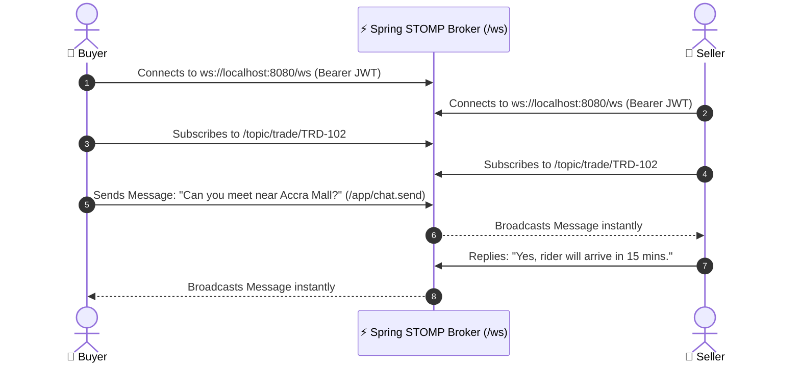

# 07 — Real-Time Messaging & Notifications

SafeTrade features an integrated, real-time communication engine enabling buyers, sellers, and dispatch riders to communicate in context regarding active escrow orders.

---

## ⚡ WebSocket Architecture (Spring STOMP)

---

## 💬 In-Trade Chat Features

- **Context-Bound Conversations**: Every chat is scoped to an individual `tradeId`, ensuring messages and trade agreements remain tied to the escrow contract for auditability during disputes.
- **Delivery Coordination**: Allows buyers and sellers to share location pins, phone numbers, and clarify meeting points safely.
- **Status Event Broadcasts**: Automated system messages (e.g. *"Trade funded in escrow"*, *"Package picked up by rider"*) are automatically injected into the chat stream.

---

## 🔔 Real-Time In-App Notifications

- **Toast System**: Built with `react-native-toast-message` for visual, non-blocking alerts (e.g., *“Trade Code Verified”*, *“Payment Received”*).
- **Badge Indicators**: Unread message counts and order status updates on bottom navigation tabs.

---

## 🔌 WebSocket Topics & Endpoints

| Endpoint / Topic | Protocol | Purpose |
|---|---|---|
| `/ws` | WebSocket / SockJS | Handshake endpoint |
| `/app/chat.send` | STOMP SEND | Send a new message to a trade chat |
| `/topic/trade/{tradeId}` | STOMP SUBSCRIBE | Receive real-time chat messages for a specific trade |
| `/user/queue/notifications` | STOMP SUBSCRIBE | Receive private user alerts & status changes |
