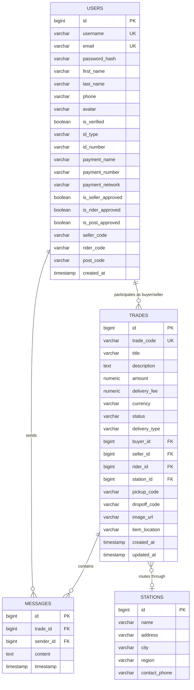

# 08 — API Reference & Database Schema

This document provides a comprehensive reference of all REST API endpoints, DTO contracts, and PostgreSQL database schemas powering the SafeTrade ecosystem.

---

## 🗄️ Database Entity Relationship (ER) Schema

---

## 📑 Core Enumerations

### 1. `TradeStatus`
- `PENDING`: Initial state upon creation.
- `FUNDED`: Escrow payment confirmed by Paystack.
- `IN_TRANSIT`: Item collected by rider / post station.
- `DELIVERED`: Delivered to destination; awaiting buyer inspection.
- `COMPLETED`: Funds successfully disbursed to seller.
- `DISPUTED`: Issue filed by buyer; escrow locked.
- `REFUNDED`: Escrow funds returned to buyer.
- `CANCELLED`: Cancelled prior to deposit.

### 2. `DeliveryType`
- `RIDER`: Dispatched via motorized courier.
- `POST_STATION`: Routed through a physical SafeTrade Post Hub.
- `IN_PERSON`: Direct face-to-face exchange with escrow release.

---

## 🌐 Complete REST API Endpoint Directory

### Authentication & User Management
- `POST /api/auth/send-signup-otp` — Request 6-digit email OTP.
- `POST /api/auth/verify-signup-otp` — Verify 6-digit OTP code.
- `POST /api/users/login` — User login & JWT issuance.
- `POST /api/users/register` — Register account with role selection and code generation.
- `POST /api/users/unlock-role` — Unlock a portal (`seller`, `rider`, `post`) via access code.
- `GET /api/users/me` — Retrieve current authenticated profile and approval flags.
- `POST /api/users/verify-account` — Submit Ghana Card / Passport for identity verification.
- `PUT /api/users/bank-details` — Configure Mobile Money payment credentials.

### Escrow Trades
- `GET /api/trades` — Retrieve user's trades (filtered by role).
- `GET /api/trades/{id}` — Get single trade details.
- `POST /api/trades` — Create a new trade contract.
- `POST /api/trades/{id}/accept` — Buyer accepts trade & initiates escrow deposit.
- `POST /api/trades/{id}/release` — Buyer confirms receipt and releases funds.
- `POST /api/trades/{id}/dispute` — Buyer initiates a dispute.
- `POST /api/trades/{id}/post-dropoff` — Post station operator verifies parcel intake.
- `POST /api/trades/{id}/buyer-collect` — Post station operator verifies buyer collection.

### Marketplace Link Scraper
- `GET /api/links/preview?url={url}` — Parse product details from Jiji, Tonaton, and Facebook Marketplace.

### Dispatch Rider
- `GET /api/rider/ongoing` — Fetch active delivery jobs for rider.
- `POST /api/rider/confirm-pickup` — Verify 4-digit pickup code.
- `POST /api/rider/confirm-delivery` — Verify 4-digit drop-off code.
