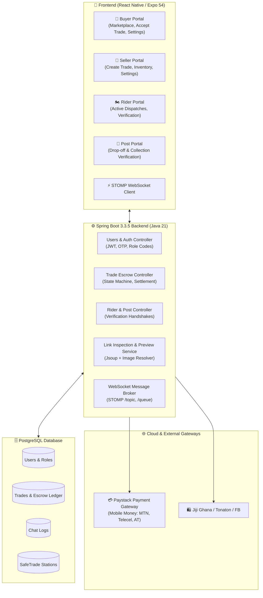

# SafeTrade Architecture & Feature Documentation Index

Welcome to the comprehensive technical documentation for **SafeTrade** — a next-generation escrow-backed trade, delivery, and marketplace inspection platform tailored for peer-to-peer commerce in Ghana.

---

## 📚 Feature Documentation Directory

Each core feature in SafeTrade is documented in detail with architecture workflows, API contracts, sequence diagrams, and UI/UX behaviors:

| # | Document | Scope & Key Features |
|---|---|---|
| **01** | [Escrow Protection & Payment Flows](./01_ESCROW_AND_PAYMENTS.md) | Paystack Mobile Money integration (MTN, Telecel, AT), Cedis (GH₵) transactions, buyer deposits, escrow lock, dispute resolution, and automated seller payouts. |
| **02** | [Marketplace Link Inspector & Scraper](./02_MARKETPLACE_AND_INSPECTION.md) | Instant preview for Jiji Ghana, Tonaton, and Facebook Marketplace links, image extraction, metadata fallback engine, Ghana location resolution, and agreed price negotiation. |
| **03** | [Portals & Role Activation System](./03_PORTAL_AND_ROLE_SYSTEM.md) | Multi-role portal isolation (Buyer, Seller, Dispatch Rider, Post Operator), Buyer marketplace exclusivity, unique `SEL-XXXX` / `RDR-XXXX` / `POST-XXXX` codes, and Settings unlock hub. |
| **04** | [Dispatch Rider Delivery System](./04_DISPATCH_RIDER_DELIVERY.md) | Dual 4-digit verification code protocol (Pickup Code & Drop-off Code), dispatch assignment, delivery fee escrow, and rider payout triggers. |
| **05** | [SafeTrade Post Network](./05_SAFETRADE_POST_NETWORK.md) | Physical SafeTrade pickup stations, Post Operator portal, secure parcel check-in, drop-off verification, and buyer collection workflows. |
| **06** | [Authentication & Identity Verification](./06_AUTHENTICATION_AND_VERIFICATION.md) | JWT auth, Email OTP verification, Ghana Card / Passport / Voter ID KYC verification, and Mobile Money payout account bindings. |
| **07** | [Real-Time Messaging & Notifications](./07_REALTIME_MESSAGING_AND_NOTIFICATIONS.md) | Spring Boot WebSockets + STOMP protocol, in-trade buyer-seller encrypted messaging, live status toast notifications, and delivery pings. |
| **08** | [API Reference & Database Schema](./08_API_AND_DATABASE_SCHEMA.md) | Complete REST API endpoint reference, DTO contracts, PostgreSQL database ER schema, and enum state machines. |

---

## 🏗️ High-Level System Architecture

---

## 💡 Tech Stack Overview

- **Frontend**: React Native, Expo SDK 54, Expo Router v6, TypeScript, NativeWind / Tailwind CSS, React Native Reanimated, STOMP.js.
- **Backend**: Java 21 LTS, Spring Boot 3.3.5, Spring Security with JWT, Spring Data JPA, Hibernate, Spring WebSocket (STOMP), Jsoup, Unirest, Jackson.
- **Database**: PostgreSQL with Hibernate auto-migrations.
- **Payment Processing**: Paystack API (Ghana MoMo + Bank cards).
